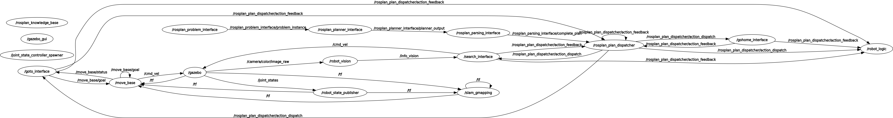

# Experimental Robotics Laboratory - Assignment 2

### Collaborators

| Name                  | ID       |
| --------------------- |:--------:|
| Nicholas Attolino     | S5656048 |
| Teodoro Lima          | S5452613 |
| Claudio Tomaiuolo     | S5630055 |

## Introduction

In this Assignment have been implemented:
- the [ROS](https://www.ros.org) package to satisfy the requirements;
-  The [aruco](https://github.com/pal-robotics/aruco_ros/tree/noetic-devel/aruco) package for acquiring and parsing the image from the camera;
-  The [gmapping](http://wiki.ros.org/gmapping) package, for building the global and local map of the navigated environment;
-  The [move_base](http://wiki.ros.org/move_base) package to drive the rosbot toward the target with obstacle avoidance;
-  The [ROSPlan](https://kcl-planning.github.io/ROSPlan/) framework for problem generation, planning and execution of the plan.

The robot is a [Husarion ROSbot 2R](https://husarion.com/#robots) and its model is provided by the package [rosbot_description](https://github.com/husarion/rosbot_ros/tree/noetic/src/rosbot_description).
The `ROSPlan` framework and the packages `aruco` and `rosbot_description` are included in this repository for convenience.

The requirements for the assignment are written here ([source](exprob_2023_assignment2.pdf)).

In this branch we implement the code for the simulation of the real rosbot. The architecture is based on:
- a node implementing the logic for generating the plan using the `ROSPlan` framework;
- a node implementing the vision data handling using the `aruco` package;
- three nodes which implement the actions used to execute the plan.

## Installation

Requirements:

- ROS Noetic environment is already installed and working properly;
- Packages [move_base](http://wiki.ros.org/move_base) and [gmapping](http://wiki.ros.org/gmapping) properly installed. These packages are used to drive the rosbot and to create the global and local map of the environment;
- Git properly installed;
- [Xterm](https://invisible-island.net/xterm/) to provide information via a separated console.
  To install it:
```shell
sudo apt update && sudo apt -y install xterm
```

For testing we used a machine with Linux Ubuntu 20.04 LTS.  


To use the packages in this repository, just clone the repository in your_catkin_workspace/src folder with this command:
```bash
git clone --branch name_of_the_branch https://repository_url.git
```

Go back into the workspace folder and build the packages
```bash
cd your_catkin_workspace
catkin_make
```

Setup the current workspace

```bash
source ./devel/setup.bash
```

Copy the marker models (the entire folder) in the local directory `.gazebo` (maybe the folder is hidden, pay attention!), otherwise the marker will not be visible in the Gazebo environment.

## Use

The simulation can be started with the provided launch file:

```bash
roslaunch assignment_2 assignment_2.launch
```

Once started, the Gazebo and RViz environments show the rosbot within the provided world with the markers.  
The rosbot will drive toward the first marker position. Once reached, it will turn looking for the marker. Once the marker is found, the rosbot will move toward the next marker.  
Once all markers have been found, the rosbot will drive toward the initial position, and once reached, we are notified with a last message as "goal achieved".
An example of simulation run is shown in the following video.

https://github.com/user-attachments/assets/45b4d82f-aaea-4ca0-83bf-f28f5f1e6706

## Architecture

We developed five nodes:  

- [robot_logic.py](#robot_logicpy-source)
- [robot_vision.py](#robot_visionpy-source)
- [go-home_interface.cpp](#go-home_interfacecpp-source)
- [goto_interface.cpp](#goto_interfacecpp-source)
- [search_interface.cpp](#search_interfacecpp-source)

The developed nodes, the Gazebo and RViz environment are organized as shown in the following `rqt_graph`:



### robot_logic.py ([source](./assignment_2/script/robot_logic.py))
It interfaces with the `ROSPlan` framework to drive the rosbot to accomplish the task:

- generates the problem,
- generates the plan,
- parse the plan to make it `ROS` compatible,
- dispatches the actions to accomplish the task

It implements a state machine to send the requests  to the `ROSPlan` services.

### robot_vision.py ([source](./assignment_2/script/robot_vision.py))
It subscribes to the following camera topics:

- `/camera/color/camera_info`  
    to calculate the position of the camera center  
- `/camera/color/image_raw`  
    to extract information about the marker in view  

It publishes the topic `/info_vision`, which provides data about the current seen marker id and the four corners of the marker.

### goto_interface.cpp ([source](./assignment_2/src/goto_interface.cpp))
It implements the `goto` action defined in the `domain`([source](./assignment_2/pddl/domain.pddl)).  
It receives the destination waypoint to reach from the dispatcher and sends the goal to the `move_base` package which drives the rosbot toward the target waypoint.

### go-home_interface.cpp ([source](./assignment_2/src/go-home_interface.cpp))
It implements the `go-home` action defined in the `domain`([source](./assignment_2/pddl/domain.pddl)).  
It receives the destination waypoint to reach from the dispatcher and sends the goal to the `move_base` package which drives the rosbot toward the target waypoint.

### search_interface.cpp ([source](./assignment_2/src/search_interface.cpp))
it implements the `search` action defined in the `domain`([source](./assignment_2/pddl/domain.pddl)).  

- It subscribes to the topic `/info_vision` to receive information about the current marker id seen by the camera.
- It receives from the dispatcher the marker id to look for.
- It sends to the rosbot the command to turn around itself until it finds the searched marker id.

## Improvements

- the vision system processes only one marker per time. If multiple markers appear in the camera's view, only the first one in the list given by the camera is taken into account;
- If the camera does not detect the desired marker ID, the Rosbot continues to turn in place, searching for the marker ID indefinitely. Probably an exception handler could be implemented to address this.
